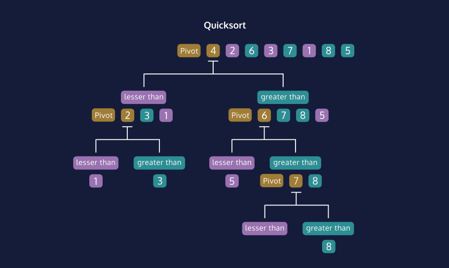

Quicksort is an efficient algorithm for sorting values in a list. A single element, the pivot, is chosen from the list.
All the remaining values are partitioned into two sub-lists containing the values smaller than and greater than the pivot element.

  
  

